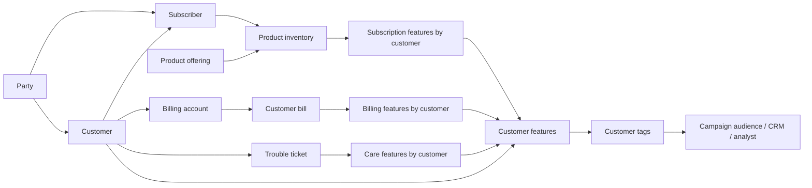

# BSS customer tagging: incremental maintenance and cost

This is a separate companion to the [xDR demo](../README.md). An operator already
has a customer base and wants current retention, collections, and cross-sell
audiences when BSS records change. The hypothesis is that maintaining those tags
from a small delta consumes much less compute than rebuilding every customer's
tags. **Measured: small deltas are incremental; a large all-in cost saving is not
yet proven.** See the [measured report](MEASURED_REPORT.md).

Status (2026-09-10): remote tests completed at 100k and 1M customers, with five
delta repetitions per scale and correctness/edge-case checks. The dedicated
benchmark cluster is suspended; test data remains and no BSS schedule is enabled.
Account-specific rates are omitted from this public copy. Invoice attribution remains pending.

## Scenario and model

Default: **100,000 customers, 150,000 subscribers, 150,000 subscriptions**. Each
subscriber has one subscription in this fixture; subscriptions are distributed
round-robin, so half the customers have two. All names, identifiers, and financial
values are synthetic. Charges are SGD; cloud costs are USD.

| Entity / grain | Default rows | Relationship and TMF inspiration |
|---|---:|---|
| `party` / individual | 250,000 | Payer parties and distinct service-user parties; TMF632 |
| `customer` / commercial relationship | 100,000 | Refers to payer party; TMF629 |
| `billing_account` / account | 100,000 | Belongs to customer; TMF666 |
| `subscriber` / service-user role | 150,000 | Refers to service-user party and owning customer; local extension |
| `product_offering` / offer | 2 | Mobile or broadband; TMF620 |
| `product_inventory` / subscription | 150,000 | Customer, subscriber, billing account, offering; TMF637 |
| `customer_bill` / bill | 100,000 | Account, due date, outstanding amount; TMF678 |
| `trouble_ticket` / ticket | 5,000 | Customer, state, priority; TMF621 |
| `customer_tags` / customer | 100,000 | Derived flags plus `rule_version`; local analytical output |

These are deliberately narrow analytical projections inspired by the
[TM Forum Open API directory](https://www.tmforum.org/open-digital-architecture/open-apis).
They do not implement the APIs or claim SID conformance. Consent and lifecycle
flags are demo extensions. Customer, subscriber, and subscription are separate
concepts; a production account may pay for several users and products. The schema
allows multiple bills/accounts/tickets per customer, although the seed is simpler.



The five feature/tag objects are manually refreshed dynamic tables. Each child
collection is aggregated to customer grain before joining it: a customer with two
subscriptions, three bills, and two tickets must not produce twelve joined rows
and inflated spend. Left joins retain customers with no subscriptions or tickets.
Business keys are declared on the source tables; relationships are validated by
the fixture, not enforced foreign keys.

## Tags and business events

Rules are in [sql/features.sql](sql/features.sql), version `bss-v1`.

| Tag | Rule for an active customer | Example event that changes it |
|---|---|---|
| `high_value` | Active monthly recurring charges total at least SGD100 | Plan upgrade/downgrade |
| `multi_line` | At least two active subscriptions | Add/terminate a line |
| `payment_risk` | At least SGD50 outstanding on bills at least 30 days overdue | Payment or ageing boundary |
| `retention_priority` | High value, and a renewal due within 30 days or an open high-priority complaint | Renewal window entry, complaint closure |
| `broadband_cross_sell` | Consented, active mobile, no active broadband, no overdue balance, no open high-priority complaint | Consent withdrawal, broadband purchase, bill settlement |
| `campaign_suppressed` | Inactive, missing/false consent, any overdue balance, or open high-priority complaint | Consent withdrawal or new arrears |

Suppression does not erase service/collections tags; it blocks campaign contact.
Missing consent fails closed. Tags are integer flags in one row per customer, so
both `1 → 0` retractions and `0 → 1` additions are visible. Deleting a customer
must remove the output row. A rule definition change requires a separate rebuild
test and a new rule version; it is not an ordinary small source delta.

`renewal_due` and `overdue_30` are persisted lifecycle flags. The seed is evaluated
as of `2026-09-10`. The `aging` stage advances the relevant boundaries one day,
including leaving the renewal window after contract expiry. Time passing is
itself an input event: a production due-event scheduler must maintain these flags
from contract and bill dates. Its lookup/write cost belongs in ingestion. Putting
`CURRENT_DATE()` in every tagging query, or joining every customer to one mutable
clock row, would change the workload and may cause broad reevaluation. The fixture's
date predicates may still scan source tables; capture their cost separately.

## Prepare and inspect

No dependencies beyond Python 3 and the already installed `cz-cli` for remote runs.
This uses the CLI's existing `cz` profile; any credentials remain in the repository's
single `.env.clickzetta`. Never supply credentials as SQL or command arguments.

```bash
python3 bss_tagging/benchmark.py prepare \
  --customers 100000 --subscriptions 150000 --changed 100 \
  --schema bss_tagging_100k --output out/bss_tagging_100k

python3 bss_tagging/benchmark.py run \
  --plan out/bss_tagging_100k/plan.json --stage delta \
  --evidence evidence/bss_tagging/100k_delta_01
```

The second command only previews SQL. Generated stage files and `plan.json` are
reviewable. Use a fresh `bss_*` schema for each independent dataset. Preparation
refuses to overwrite an output directory. Remote initialization deliberately
fails if the schema exists; it never drops/replaces another experiment.

The SQL seed is generated in Lakehouse with `INSERT … SELECT`; seed generation is
measured separately. It is a model of BSS current-state data after ingestion, not
an implemented CRM CDC connector or a benchmark of external extraction/networking.
The `seed_numbers` helper contains customers + subscribers rows; exclude its
retained storage from a production tagging estimate or disclose it as test overhead.

## Execute a bounded experiment

Choose the target profile and VCluster, then explicitly execute the following
stages. Dynamic tables have no refresh interval; no scheduler or timer is created.
All writes, including `REFRESH`, pass through `cz-cli sql --write` and every SQL
statement/result is captured. Commands wait for terminal results; errors stop the
stage, append the exact redacted error to `findings.md`, and never retry silently.
After diagnosing a failure, add the concrete minimal fix to that finding before
resuming. Do not rerun an entire partially completed stage: an update may already
have committed. A timeout has an unknown remote outcome.

```bash
python3 bss_tagging/benchmark.py run --execute --profile cz --vcluster DEFAULT \
  --plan out/bss_tagging_100k/plan.json --stage init \
  --evidence evidence/bss_tagging/100k_init

python3 bss_tagging/benchmark.py run --execute --profile cz --vcluster DEFAULT \
  --plan out/bss_tagging_100k/plan.json --stage bootstrap \
  --evidence evidence/bss_tagging/100k_bootstrap

python3 bss_tagging/benchmark.py run --execute --profile cz --vcluster DEFAULT \
  --plan out/bss_tagging_100k/plan.json --stage explain \
  --evidence evidence/bss_tagging/100k_explain

python3 bss_tagging/benchmark.py run --execute --profile cz --vcluster DEFAULT \
  --plan out/bss_tagging_100k/plan.json --stage delta \
  --evidence evidence/bss_tagging/100k_delta_01
```

Use a dedicated, otherwise idle GP VCluster for a dollar-cost experiment when one
is available. `DEFAULT` permits a functional test, but existing xDR traffic makes
its bill unsuitable for attributing BSS cost. The basic `benchmark.py` harness
does not manage clusters; `measure.py` adds explicit benchmark setup and shutdown
stages. Neither changes xDR objects or schedules. Set an agreed spend/time budget before large
remote experiments; the runner's timeout is per statement, not an account budget.
Stop after 30 minutes on one blocker, as in the parent runbook.

For each case, freeze source writes, refresh all five DTs in dependency order,
materialize the full control from raw source tables using the same rules, then
compare every tag and customer ID in both directions. Count/uniqueness checks
catch missing customers and duplicate rows. Any mismatch stops the run. The full
control uses no feature DTs. Validate its physical plan reads base tables, without
result-cache reuse or optimizer substitution, before reporting performance.
The default order is incremental then full, which can warm source caches for the
control. Record that order and cache state. Before making a general speed claim,
also measure pairs with reversed order in a separately reviewed plan. Validation
and evidence queries are benchmark overhead and must not be counted as tagging
compute, though they still contribute to the experiment's actual bill.

| Stage | Purpose / interpretation |
|---|---|
| `init`, `bootstrap` | One-time source creation, seed and initial materialization; exclude from steady state |
| `noop` | No changed inputs; expect `NO_DATA` or measured equivalent, not zero dollars |
| `delta` | Selected customers change consent and recurring charge; several source rows per customer |
| `payment` | Clear positive balances for selected accounts; should retract payment/suppression tags |
| `care_close` | Close selected open complaints; re-evaluate retention and campaign eligibility |
| `terminate` | Terminate every subscription for selected customers; includes loss of last active line |
| `aging` | Date-window entry/exit with no CRM update; includes source boundary detection cost |
| `catalog_fanout` | One offer changes family; intentionally affects many subscriptions/customers |
| `delete_customer` | Remove selected synthetic customers and their tag rows; run last |
| `explain` | `EXPLAIN REFRESH DYNAMIC TABLE` with incrementality flag, saved as raw JSON |
| `consume` | Read up to 100 eligible customer IDs from the materialized tags |

Run bootstrap, then at least five measured `delta` repetitions and five `noop`
repetitions with unique evidence directories. Exclude one warm-up pair. Repeated
delta batches toggle consent and increase charges by SGD1, so they are real
updates; other cases can become no-ops after their first run. Test edge cases on
fresh schemas if comparing them independently. `catalog_fanout` must not be
presented as a one-customer change. Run `delete_customer` last because it leaves
synthetic child records orphaned deliberately to test output deletion.

Scaling matrix: 100k/1M/10M customers at 1.5 subscriptions each; changed-customer
fractions 0%, 0.01%, 0.1%, 1%, 10%. Also hold the delta at 100 customers while
increasing the base. The configurable `--changed` count uses a deterministic
permutation to spread keys. Record actual changed source rows and distinct
affected customers; do not use selected customers as a substitute for either.
Test realistic history depth/skew separately: this seed has one bill per account
and uniformly distributed subscriptions, so it does not establish scale under
large household/business accounts or years of bills.

## What counts as evidence

The xDR findings already showed both small surgical retractions and contaminated
full rewrites, plus idle refreshes keeping a cluster awake. Carry those lessons
forward without treating the earlier interpretation as this benchmark's result.

The harness saves SQL, stdout JSON, stderr, UTC submission time, client elapsed
time, job IDs and category in each evidence directory. It also requests
`sys.information_schema.job_history` fields for captured IDs. Access/visibility
and ingestion lag may leave those records missing; missing is **unknown**, never
zero. Reconcile refresh-history job IDs with actual execution jobs before summing.
Pre-change queries count qualifying source rows and distinct affected customers.
The old full-control snapshot is compared to refreshed tags before replacement to
count individual flag transitions plus customer-row additions/removals. The first
bootstrap comparison is not a steady-state transition measurement.
History contains earlier runs too: select only this run's jobs/times, and do not
sum everything returned. Parent and child job metrics must not be double counted.

Capture additional raw profile JSON for the exact refresh/full-control job IDs
when scan, CPU, shuffle, or write metrics are absent from job history. Record
source table versions/snapshot boundaries and VCluster size/type/cache state with
each comparison. Export billing/metering for the isolated time windows from the
account's billing statement, including any overlapping background work.

`INCREMENTAL` is necessary evidence, but does not prove low physical work.
Refresh `stats` reports changes; **rows inserted/deleted are not rows scanned**.
Compare input bytes/records in actual job profiles, CPU time if exposed, shuffle,
write bytes and durations across the **whole five-table chain**. Client wall time
includes connection, compilation, queuing and polling; it is not a billing meter.
Refresh history is retained only for a limited window, so capture it immediately.
See [refresh evidence](https://www.singdata.com/documents/dynamic-table-incre).

Acceptance gates, chosen for this demo rather than claimed platform guarantees:

1. Zero tag mismatches, missing customer rows or duplicate customer IDs for all
   semantic cases, including retractions and deletion.
2. Small deltas use incremental maintenance across the chain after bootstrap.
3. At 0.1% changed customers, target at least 80% less measured scan work and
   active compute than the full control. Report failures and fixed overhead.
4. At a fixed 100-customer delta, growing the base 10× should grow measured work
   far less than 10×. Quantify it; never infer it from the plan label alone.
5. Demonstrate the same freshness SLA and compare isolated billed CRU-hours.
   Report medians and p95 across repetitions, not the best cycle.

## Cost attribution

| Cost part | Include / measure |
|---|---|
| Bootstrap | Initial synthetic loading and first build; report separately, optionally amortize |
| Source ingestion | BSS change extraction, CDC/current-state writes and due-event detection; synthetic SQL updates are only the demo proxy |
| Feature maintenance | All subscription, billing, care and joined customer DT refreshes |
| Tag evaluation | Final customer tag DT; compare separately and as part of the full chain |
| Idle / scheduling | Idle VC tail, activation minimum, scheduler resources; `NO_DATA` is not free by definition |
| Storage | Source, intermediate, tag and control tables; distinguish benchmark-only storage and retained state |
| Consumption | Audience lookup/export, API/dashboard query compute, outbound bytes, downstream CRM work |
| Background work | Compaction/maintenance and other workload use; reconcile with metering, avoid double counting |

Published AWS Singapore reference prices checked 2026-09-10: **US$1.86/CRU-hour**,
**US$0.025/GiB-month** storage, **US$0.12/GB** internet egress. Billing depends on
the account's actual rate and resource usage; credits are payment, not zero
resource cost. [Pricing source](https://www.singdata.com/documents/pricing-lakehouse).
VCluster documentation specifies a one-minute minimum per activation and billing
until the cluster stops. [Cluster source](https://www.singdata.com/documents/virtual-cluster).

For a dedicated constant-size single-replica VC:

`VC USD = billed running seconds × CRU × USD per CRU-hour / 3600`

For changing sizes/replicas, integrate over each interval. On a shared cluster,
job runtime × provisioned CRU is only an allocation proxy. It is not independent
per-job billing, and lower work may free capacity without reducing today's bill.
Do not add per-job proxy cost to the same cluster's metered cost.

Illustration only: if an incremental chain takes 10 seconds, the full rebuild
takes 120 seconds, idle shutdown is 60 seconds, and both run every 15 minutes on
1 CRU, the compute-only 30-day estimate is:

| Method | Assumed work / cycle | Billed active + idle / cycle | USD / cycle | USD / 30 days |
|---|---:|---:|---:|---:|
| Incremental | 10s | 70s | 0.0362 | 104.16 |
| Full control | 120s | 180s | 0.0930 | 267.84 |
| Always on | — | 900s | 0.4650 | 1,339.20 |

These assumed timings are **not measurements**. They show why a 91.7% active-work
reduction could yield only a 61.1% VC-cost reduction, and why cadence matters.
At 100 changed customers/cycle the illustrative incremental VC cost is
US$0.000362 per customer reevaluation; it is not cost per unique monthly customer
or per tag transition. Include ingestion, storage, consumption and any separately
metered scheduling resources before describing the all-in cost.

```bash
python3 bss_tagging/benchmark.py cost --rate 1.86 --active-seconds 10
python3 bss_tagging/benchmark.py cost --rate 1.86 --active-seconds 120
```

The calculator models regular dedicated-VC cycles and a minimum activation floor.
It labels outputs illustrative, flags work exceeding the cadence, and does not
claim queue/backlog performance. Actual billing exports take precedence.

Actual results are in [measured_results.csv](measured_results.csv) and the
[measured report](MEASURED_REPORT.md); [results.csv](results.csv) remains a template.
Report bootstrap cost, cost per changed customer, cost per actual tag transition,
cost per 1,000 tag rows served, monthly cost at the chosen cadence, and freshness.
Zero-change cycles have no per-changed-customer denominator. A snapshot audience
export scales with audience size even if tag computation is incremental; CRM
delta delivery would need a separate change-consumption pipeline and cost test.

## Local verification

```bash
python3 -m py_compile bss_tagging/benchmark.py bss_tagging/test_benchmark.py
python3 -m unittest discover -s bss_tagging -p 'test_*.py' -v
```

Tests execute the source SQL and full tagging query in SQLite with small adapter
functions, comparing results to an independently written Python oracle. They cover
join fanout, absent child rows, missing consent, payments, closure, termination,
ageing, catalog changes, deletion, cost floors, and logged failure handling.
This validates business logic and local orchestration, **not** ClickZetta SQL
compilation, refresh incrementality, telemetry permissions, or actual dollar cost.
